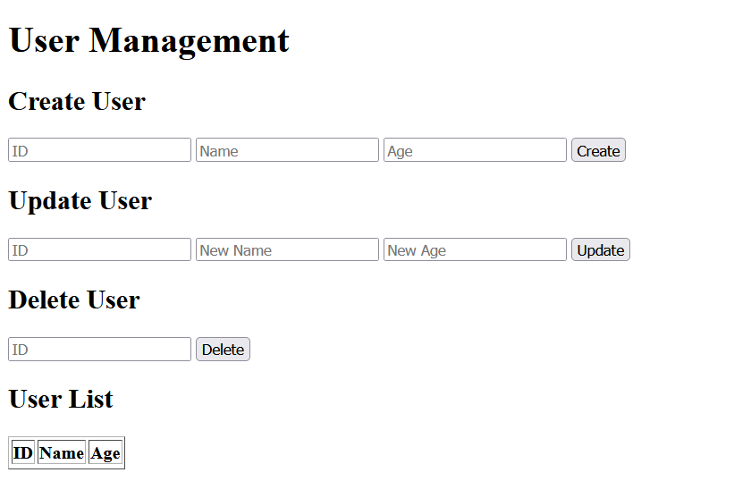

---
# CyberCar Store 🚙

## Project Description ✒️
CyberCar Store is a web application designed for selling cybercars to users.  
The application provides functionality for managing users through CRUD operations (Create, Read, Update, Delete).  

The project uses **MongoDB** as the database, and interaction is possible through a web interface and API tools like **Postman**.  

---

## Team Members 🧑
- Saulet Kabdrakhmanov SE - 2307
- Agybetov Nurbol SE - 2307


---

## Screenshot of the Main Page


---

## Project Goals 🎯
- Selling modern cybercars to users.
- Managing user data to ensure a personalized approach.
- Creating an intuitive interface for working with user data.
- Supporting integration through APIs for process automation.

---

## Project Features
- CRUD operations for user management:
  - Adding new users.
  - Retrieving a list of users.
  - Updating user information.
  - Deleting users.
- Data storage in MongoDB.
- Support for both web interface and Postman API interactions.

---

## How to Run the Project

### Requirements:
- [Go](https://go.dev/) (version 1.19 or higher)
- [MongoDB](https://www.mongodb.com/) (locally or in the cloud)
- A browser for the web interface
- [Postman](https://www.postman.com/) for API testing

### Steps to Run:
1. Clone the repository:
   ```bash
   git clone https://github.com/SauletTheBest/CyberCar-store/issues
   cd CyberCar-store
   ```

2. Configure MongoDB:
   - Ensure MongoDB is running on `localhost:27017`.
   - Update the connection string in `main.go` if necessary.

3. Install dependencies:
   ```bash
   go mod tidy
   ```

4. Start the server:
   ```bash
   go run main.go
   ```

5. Open the web interface in your browser:
   ```
   http://localhost:8080
   ```

6. For API testing:
   - Usage of Postman (CRUD operations)

---

## API Endpoints
### User Management
- `POST /users` — add a new user.
- `GET /users` — retrieve a list of all users.
- `GET /users/{id}` — get user details by ID.
- `PUT /users/{id}` — update user details by ID.
- `DELETE /users/{id}` — delete a user by ID.

---

## Technologies Used
- **Programming Language:** Go (Golang), HTML 
- **Database:** MongoDB
- **Tools:**
  - [Postman](https://www.postman.com/) — for API testing.
  - `html/template` — for rendering HTML.
  - `go.mongodb.org/mongo-driver` — for working with MongoDB.
- **Development Environment:**
  - Visual Studio Code
  - GitHub
  - Goland
- **Resources:**
  - [MongoDB Documentation](https://www.mongodb.com/docs/)
  - [Go Documentation](https://go.dev/doc/)
---

## Feedback
If you have any questions or suggestions, create an [Issue](https://github.com/SauletTheBest/CyberCar-store/issues) in the repository.
```

---

If there’s anything else you’d like to refine or adjust, feel free to ask!
